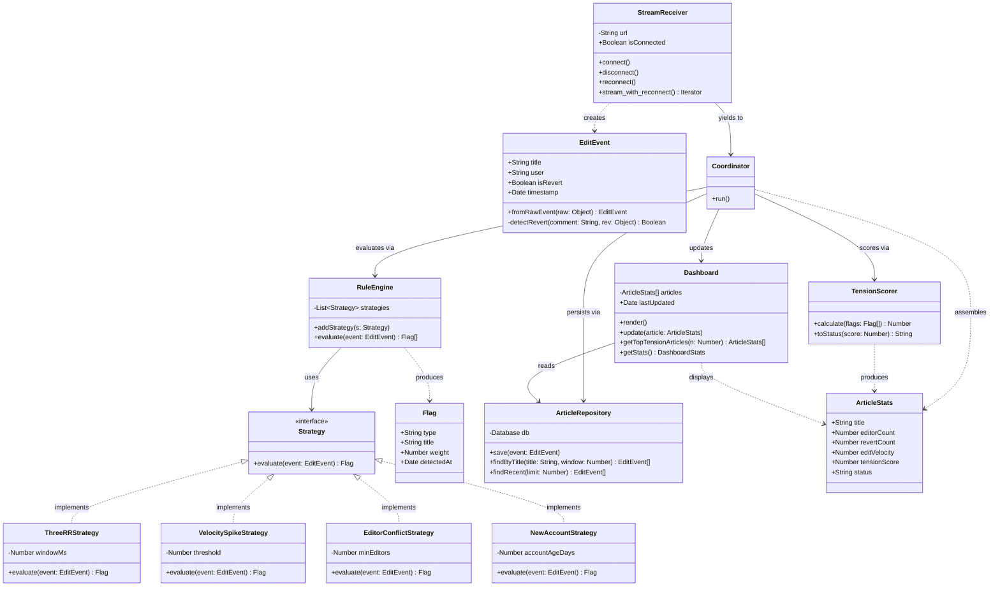

```mermaid
classDiagram
    direction TB

    class StreamReceiver {
        -String url
        +Boolean isConnected
        +connect()
        +disconnect()
        +reconnect()
        +stream_with_reconnect() Iterator
    }

    class EditEvent {
        +String title
        +String user
        +Boolean isRevert
        +Date timestamp
        +fromRawEvent(raw: Object) EditEvent
        -detectRevert(comment: String, rev: Object) Boolean
    }

    class RuleEngine {
        -List~Strategy~ strategies
        +addStrategy(s: Strategy)
        +evaluate(event: EditEvent) Flag[]
    }

    class Strategy {
        <<interface>>
        +evaluate(event: EditEvent) Flag
    }

    class ThreeRRStrategy {
        -Number windowMs
        +evaluate(event: EditEvent) Flag
    }

    class VelocitySpikeStrategy {
        -Number threshold
        +evaluate(event: EditEvent) Flag
    }

    class EditorConflictStrategy {
        -Number minEditors
        +evaluate(event: EditEvent) Flag
    }

    class NewAccountStrategy {
        -Number accountAgeDays
        +evaluate(event: EditEvent) Flag
    }

    class Flag {
        +String type
        +String title
        +Number weight
        +Date detectedAt
    }

    class TensionScorer {
        +calculate(flags: Flag[]) Number
        +toStatus(score: Number) String
    }

    class ArticleRepository {
        -Database db
        +save(event: EditEvent)
        +findByTitle(title: String, window: Number) EditEvent[]
        +findRecent(limit: Number) EditEvent[]
    }

    class ArticleStats {
        +String title
        +Number editorCount
        +Number revertCount
        +Number editVelocity
        +Number tensionScore
        +String status
    }

    class Coordinator {
        +run()
    }

    class Dashboard {
        -ArticleStats[] articles
        +Date lastUpdated
        +render()
        +update(article: ArticleStats)
        +getTopTensionArticles(n: Number) ArticleStats[]
        +getStats() DashboardStats
    }

    StreamReceiver ..> EditEvent : creates
    StreamReceiver --> Coordinator : yields to
    Coordinator --> RuleEngine : evaluates via
    Coordinator --> ArticleRepository : persists via
    Coordinator --> TensionScorer : scores via
    Coordinator ..> ArticleStats : assembles
    Coordinator --> Dashboard : updates
    RuleEngine --> Strategy : uses
    Strategy <|.. ThreeRRStrategy : implements
    Strategy <|.. VelocitySpikeStrategy : implements
    Strategy <|.. EditorConflictStrategy : implements
    Strategy <|.. NewAccountStrategy : implements
    RuleEngine ..> Flag : produces
    TensionScorer ..> ArticleStats : produces
    Dashboard --> ArticleRepository : reads
    Dashboard ..> ArticleStats : displays
```
