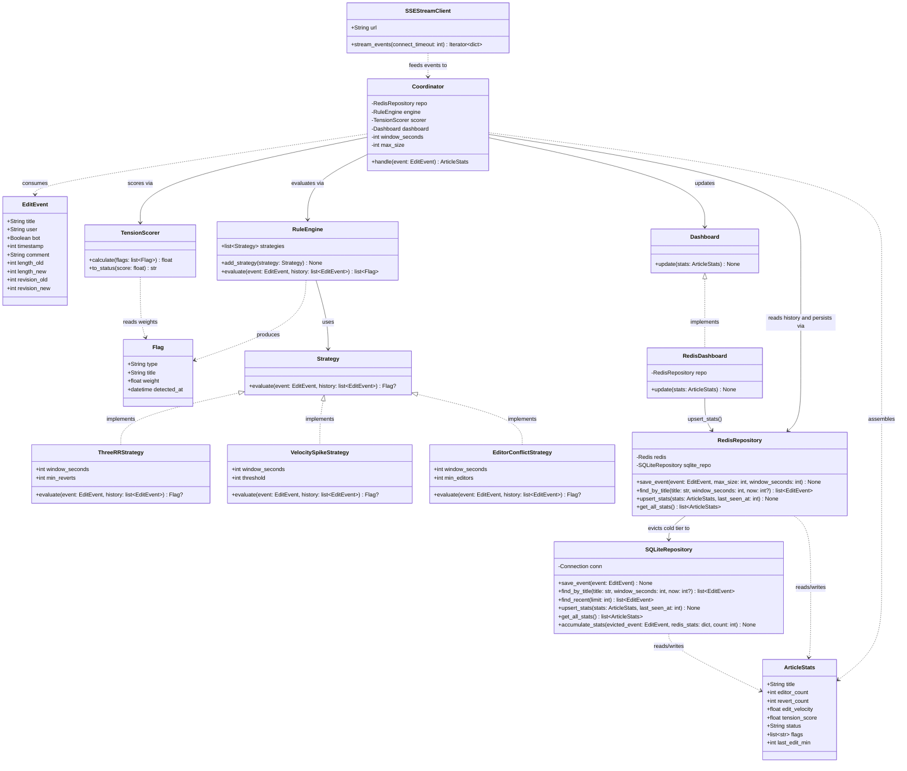

```mermaid
classDiagram
    direction TB

    class SSEStreamClient {
        +String url
        +stream_events(connect_timeout: int) Iterator~dict~
    }

    class EditEvent {
        +String title
        +String user
        +Boolean bot
        +int timestamp
        +String comment
        +int length_old
        +int length_new
        +int revision_old
        +int revision_new
    }

    class ArticleStats {
        +String title
        +int editor_count
        +int revert_count
        +float edit_velocity
        +float tension_score
        +String status
        +list~str~ flags
        +int last_edit_min
    }

    class Flag {
        +String type
        +String title
        +float weight
        +datetime detected_at
    }

    class Strategy {
        +evaluate(event: EditEvent, history: list~EditEvent~) Flag?
    }

    class ThreeRRStrategy {
        +int window_seconds
        +int min_reverts
        +evaluate(event: EditEvent, history: list~EditEvent~) Flag?
    }

    class VelocitySpikeStrategy {
        +int window_seconds
        +int threshold
        +evaluate(event: EditEvent, history: list~EditEvent~) Flag?
    }

    class EditorConflictStrategy {
        +int window_seconds
        +int min_editors
        +evaluate(event: EditEvent, history: list~EditEvent~) Flag?
    }

    class RuleEngine {
        +list~Strategy~ strategies
        +add_strategy(strategy: Strategy) None
        +evaluate(event: EditEvent, history: list~EditEvent~) list~Flag~
    }

    class TensionScorer {
        +calculate(flags: list~Flag~) float
        +to_status(score: float) str
    }

    class Coordinator {
        -RedisRepository repo
        -RuleEngine engine
        -TensionScorer scorer
        -Dashboard dashboard
        -int window_seconds
        -int max_size
        +handle(event: EditEvent) ArticleStats
    }

    class Dashboard {
        +update(stats: ArticleStats) None
    }

    class RedisDashboard {
        -RedisRepository repo
        +update(stats: ArticleStats) None
    }

    class SQLiteRepository {
        -Connection conn
        +save_event(event: EditEvent) None
        +find_by_title(title: str, window_seconds: int, now: int?) list~EditEvent~
        +find_recent(limit: int) list~EditEvent~
        +upsert_stats(stats: ArticleStats, last_seen_at: int) None
        +get_all_stats() list~ArticleStats~
        +accumulate_stats(evicted_event: EditEvent, redis_stats: dict, count: int) None
    }

    class RedisRepository {
        -Redis redis
        -SQLiteRepository sqlite_repo
        +save_event(event: EditEvent, max_size: int, window_seconds: int) None
        +find_by_title(title: str, window_seconds: int, now: int?) list~EditEvent~
        +upsert_stats(stats: ArticleStats, last_seen_at: int) None
        +get_all_stats() list~ArticleStats~
    }

    SSEStreamClient ..> Coordinator : feeds events to
    Coordinator --> RedisRepository : reads history and persists via
    Coordinator --> RuleEngine : evaluates via
    Coordinator --> TensionScorer : scores via
    Coordinator --> Dashboard : updates
    Coordinator ..> ArticleStats : assembles
    Coordinator ..> EditEvent : consumes
    RuleEngine --> Strategy : uses
    Strategy <|.. ThreeRRStrategy : implements
    Strategy <|.. VelocitySpikeStrategy : implements
    Strategy <|.. EditorConflictStrategy : implements
    RuleEngine ..> Flag : produces
    TensionScorer ..> Flag : reads weights
    Dashboard <|.. RedisDashboard : implements
    RedisDashboard --> RedisRepository : upsert_stats()
    RedisRepository --> SQLiteRepository : evicts cold tier to
    RedisRepository ..> ArticleStats : reads/writes
    SQLiteRepository ..> ArticleStats : reads/writes
```
