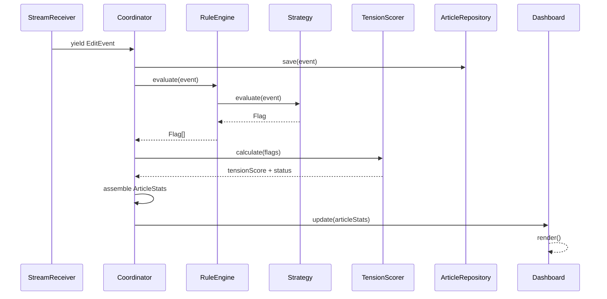

```mermaid
sequenceDiagram
    participant SR as StreamReceiver
    participant CO as Coordinator
    participant RE as RuleEngine
    participant ST as Strategy
    participant TS as TensionScorer
    participant AR as ArticleRepository
    participant DB as Dashboard

    SR->>CO: yield EditEvent
    CO->>AR: save(event)
    CO->>RE: evaluate(event)
    RE->>ST: evaluate(event)
    ST-->>RE: Flag
    RE-->>CO: Flag[]
    CO->>TS: calculate(flags)
    TS-->>CO: tensionScore + status
    CO->>CO: assemble ArticleStats
    CO->>DB: update(articleStats)
    DB-->>DB: render()
```
