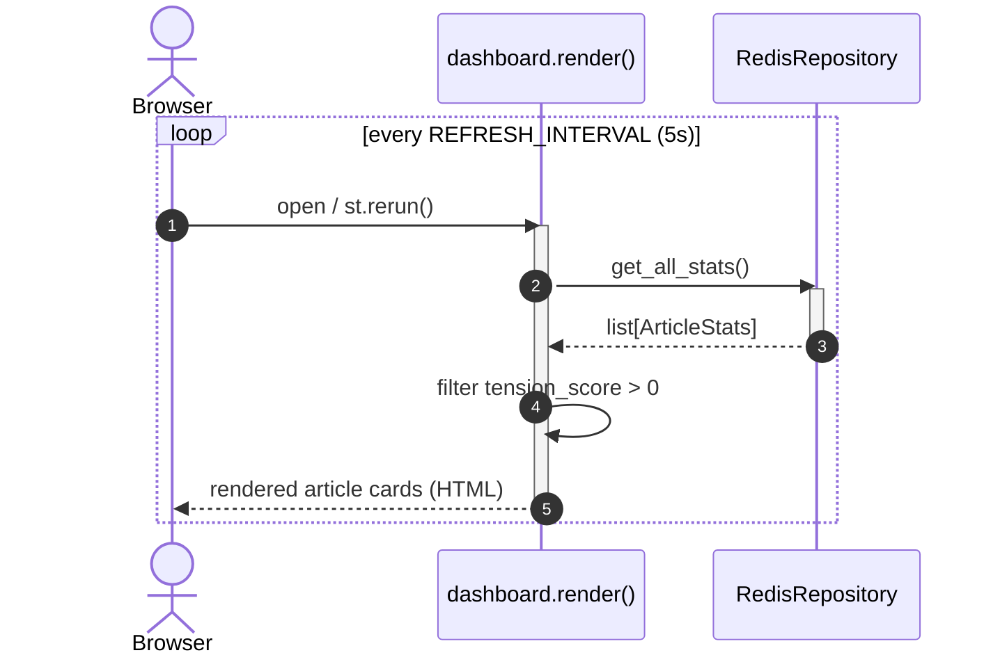

```mermaid
sequenceDiagram
    autonumber
    actor U as Browser
    participant AP as dashboard.render()
    participant RR as RedisRepository

    loop every REFRESH_INTERVAL (5s)
        U->>AP: open / st.rerun()
        activate AP
        AP->>RR: get_all_stats()
        activate RR
        RR-->>AP: list[ArticleStats]
        deactivate RR
        AP->>AP: filter tension_score > 0
        AP-->>U: rendered article cards (HTML)
        deactivate AP
    end
```