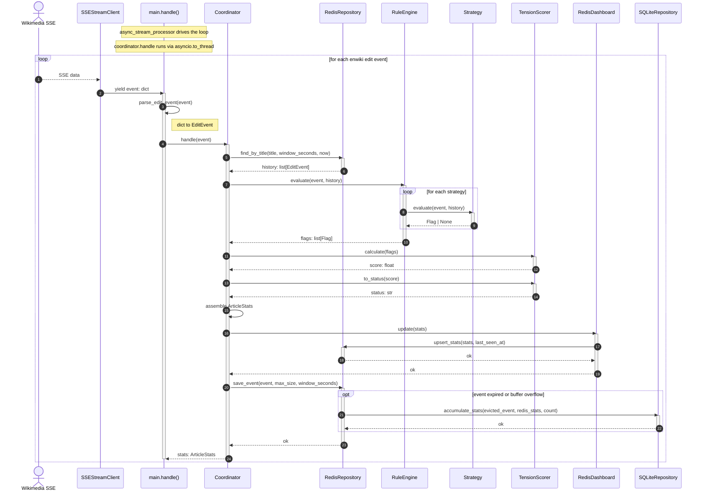

# Sequence Diagrams (v2)

```mermaid
sequenceDiagram
    autonumber
    actor WM as Wikimedia SSE
    participant CL as SSEStreamClient
    participant MA as main.handle()
    participant CO as Coordinator
    participant RR as RedisRepository
    participant RE as RuleEngine
    participant ST as Strategy
    participant TS as TensionScorer
    participant DA as RedisDashboard
    participant SQ as SQLiteRepository

    Note over MA: async_stream_processor drives the loop
    Note over MA: coordinator.handle runs via asyncio.to_thread
    loop for each enwiki edit event
        WM-->>CL: SSE data
        CL->>MA: yield event: dict
        activate MA
        MA->>MA: parse_edit_event(event)
        Note right of MA: dict to EditEvent

        MA->>CO: handle(event)
        activate CO

        CO->>RR: find_by_title(title, window_seconds, now)
        activate RR
        RR-->>CO: history: list[EditEvent]
        deactivate RR

        CO->>RE: evaluate(event, history)
        activate RE
        loop for each strategy
            RE->>ST: evaluate(event, history)
            activate ST
            ST-->>RE: Flag | None
            deactivate ST
        end
        RE-->>CO: flags: list[Flag]
        deactivate RE

        CO->>TS: calculate(flags)
        activate TS
        TS-->>CO: score: float
        deactivate TS
        CO->>TS: to_status(score)
        activate TS
        TS-->>CO: status: str
        deactivate TS

        CO->>CO: assemble ArticleStats

        CO->>DA: update(stats)
        activate DA
        DA->>RR: upsert_stats(stats, last_seen_at)
        activate RR
        RR-->>DA: ok
        deactivate RR
        DA-->>CO: ok
        deactivate DA

        CO->>RR: save_event(event, max_size, window_seconds)
        activate RR
        opt event expired or buffer overflow
            RR->>SQ: accumulate_stats(evicted_event, redis_stats, count)
            activate SQ
            SQ-->>RR: ok
            deactivate SQ
        end
        RR-->>CO: ok
        deactivate RR

        CO-->>MA: stats: ArticleStats
        deactivate CO
        deactivate MA
    end
```

