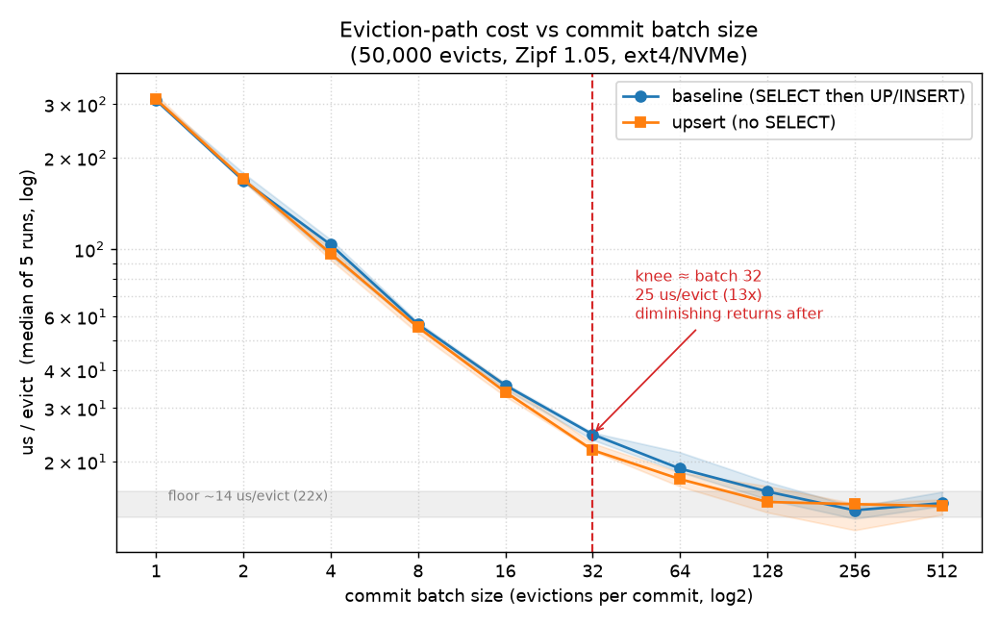

## 논의 내용

eviction 시점의 `accumulate_stats` 존재 여부 확인(`SELECT 1 FROM article_stats WHERE title = ?`)을
Bloom filter로 건너뛰자는 제안(`feat/31-bloom_filter`)을 벤치마크로 검증하고 방향을 결정했다.

> 2026-05-31 회의의 보류 사항("Bloom filter 도입 — 추후 검토")에 대한 결론.

---

## 문제 인식

현 구조는 ring buffer에서 이벤트가 evict될 때마다, 삭제 직전에 SQLite에 `SELECT`를 날려
존재하면 누적 UPDATE, 없으면 (count>=3) INSERT를 결정한다.
제안: evict마다 SELECT가 강제되는 것이 비효율 → Bloom filter로 "확실히 없음"이면 SELECT 생략.

---

## 검증 방법

- `scripts/bench_evict_lookup.py` — redis 없이 stdlib(sqlite3+hashlib)로 evict 경로 재현.
- Zipf 분포 트래픽으로 동일 워크로드를 4전략에 동일 재생: baseline(현행) / bloom / exactset(`set[str]`) / upsert(SELECT 제거).
- 규모: titles=50,000, evictions=100,000, zipf=1.05, prepopulate=30%.
- `--commit-batch N`으로 per-evict commit(fsync) 영향 분리. batch ∈ {1, 10, 50, 100}.
- **각 전략 7회 반복 → median 보고**(런 간 시스템 변동 흡수). 측정 대상은 정규화된 us/evict.
- **실디스크에서 측정**: DB는 `./bench_evict.db`(ext4, NVMe SSD). `/tmp`가 tmpfs(RAM)면 fsync 비용이 가려지므로 회피, 스크립트가 fstype을 출력·경고.

---

## 측정 결과

us/evict, **7회 median** (괄호는 baseline 대비 배수):

| commit-batch | baseline | bloom | exactset | upsert |
|--------------|----------|-------|----------|--------|
| 1   | 309.4 | 321.5 (0.96x) | 324.6 (0.95x) | 315.7 (0.98x) |
| 10  | 47.84 | 56.15 (0.85x) | 51.14 (0.94x) | 50.13 (0.95x) |
| 50  | 22.29 | 26.41 (0.84x) | 22.57 (0.99x) | 20.89 (1.07x) |
| 100 | 18.32 | 22.68 (**0.81x**) | 18.56 (0.99x) | 16.64 (**1.10x**) |

miss rate 73.0% / bloom·exact 실효 skip 13.0% (모든 batch 동일).

- **SELECT는 병목이 아님.** batch=1에서 4전략 편차 ~5% 이내. 지배 비용은 evict당 `commit()`의 fsync(median ~309us, ext4/NVMe 실디스크).
- **commit 배치화가 진짜 레버.** baseline 309 → 18.3 us/evict로 **약 17배**. 이득의 대부분은 batch≈50까지(~14배)에서 나오고 그 뒤는 체감 감소(50→100은 22.3→18.3). batch 50~100이면 충분, 그 이상은 유실 위험만 키운다.
- **fsync를 걷어낼수록 bloom은 더 나빠짐** (0.96x → 0.85x → 0.84x → 0.81x). 해시(k-probe) 비용이 fsync에 가려져 있다가 드러난 것. miss rate 73%인데 실효 skip이 13%뿐인 것도 한계 — count>=3 miss는 첫 등장 시 INSERT되어 즉시 present가 되므로 반복 skip되는 건 저활성 title뿐.
- **upsert는 batch가 커질수록 약간 유리**(0.98x → 1.10x). fsync가 사라지자 절약한 SELECT 한 번이 드러난 것. exactset은 전 구간 동률(0.94~0.99x). 둘 다 false positive·추가 메모리·재시작 위험 없음.

> 합성 workload 기반이라 절대 배수는 환경 의존. 자소서엔 "이벤트당 처리 시간 약 309µs → 18µs(약 17배), commit 빈도가 SELECT보다 주요 병목임을 확인" 수준으로 보수적으로.

---

## 최적 batch size 탐색

baseline·upsert를 batch 1~512(log2 간격, 각 5회 median)로 sweep해 곡선을 그렸다 (`scripts/plot_batch_sweep.py`).

us/evict (baseline median):

| batch | 1 | 2 | 4 | 8 | 16 | 32 | 64 | 128 | 256 | 512 |
|-------|---|---|---|---|----|----|----|-----|-----|-----|
| us/evict | 309 | 168 | 104 | 56.6 | 35.7 | 24.6 | 19.0 | 16.0 | 13.8 | 14.6 |
| vs batch1 | 1x | 1.8x | 3.0x | 5.5x | 8.7x | 12.6x | 16x | 19x | 22x | 21x |

- **knee ≈ batch 32** (log-log 곡선의 elbow). 24.6 us/evict, **12.6배**. 여기까지가 거의 선형 구간(batch 2배 → 시간 약 절반)이고, 이후는 체감 감소.
- **floor ≈ 14 us/evict (22배), batch 256에서 도달.** 이건 fsync가 사라진 뒤 남는 SELECT/UPDATE + Python 루프의 순수 연산 바닥값. batch 512는 오히려 소폭 상승(큰 WAL 트랜잭션 오버헤드) → **256 이상은 무의미**.
- baseline·upsert 곡선은 거의 겹치며, 중간 batch에서 upsert가 약간 아래(예: batch 32에서 21.8 vs 24.6).

**권장 batch = 32~64.** knee를 지나면서도 floor의 ~80%를 확보(19~25 us/evict, 12~16배)하고, crash 시 유실은 최대 32~64 evict로 제한된다. floor(22배)를 위해 batch 128~256까지 키우는 건 마지막 ~30% throughput 때문에 유실 위험을 4~8배로 늘리는 셈이라, cold-tier 누적 용도엔 과하다.

---

## 결정 사항

1. **Bloom filter 도입 기각.** batch=1에선 무효(0.98x), batch가 커질수록 유해(최대 0.80x). 추가로 재시작 시 under-populated → 오탐("없음")으로 인한 INSERT PK 충돌 위험까지 있어 비용 대비 이득이 음수.
2. **진짜 최적화는 `accumulate_stats`의 per-evict `commit()` 배치화** (storage.py:185). evict는 cold-tier 누적이라 약간의 지연/유실 허용폭이 있어 N건 또는 시간 윈도우 묶음 커밋 가능. 곡선 knee가 **batch 32**(12.6배)이고 floor는 batch 256에서 22배 → **batch 32~64 채택**이 throughput/유실 위험 균형점(위 "최적 batch size 탐색" 참조).
3. **SELECT 제거(upsert 패턴)는 선택 사항.** `UPDATE` 후 `rowcount==0`이고 count>=3이면 `INSERT`. 정식 규모 속도는 baseline과 동률이라 성능 목적은 아님 — 코드 단순화·정확성·메모리 0의 정성적 이점만 노린다면 채택, 아니면 현행 SELECT 유지도 무방.

---

## 후속 작업

- [ ] `feat/31-bloom_filter` 브랜치 방향 전환 (Bloom 구현 중단).
- [ ] `accumulate_stats` / `save_event` commit 배치화 설계 및 적용.
- [ ] (선택) `accumulate_stats`의 SELECT를 upsert 패턴으로 단순화.
- [x] `scripts/bench_evict_lookup.py` 벤치마크 추가.
